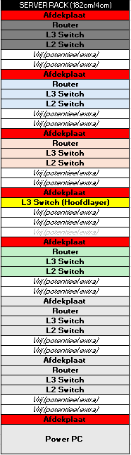

# Rack Architecture & Layout Planning

Het opbouwen van een netwerk-rack vereist een goede verdeling van gewicht, warmte-afvoer en kabelbeheer.

## Ontwerpregels die ik heb toegepast:

1. **Virtueel Ontwerp:** Elk rack is eerst virtueel in Excel uitgetekend (bijv. positie van switches, routers en afdekplaten) voordat er één schroef werd aangedraaid.
2. **Kabelbeheer:** Gebruik van klittenband (velcro) in plaats van harde kabelbinders om schade aan UTP/glasvezelkabels te voorkomen en flexibiliteit te behouden.
3. **Luchtstroom & Ruimte:** Rekening gehouden met ruimte (screws/units openlaten) voor afdekplaten en optimale ventilatie tussen zware apparaten.

